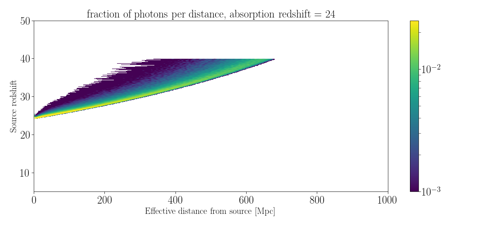
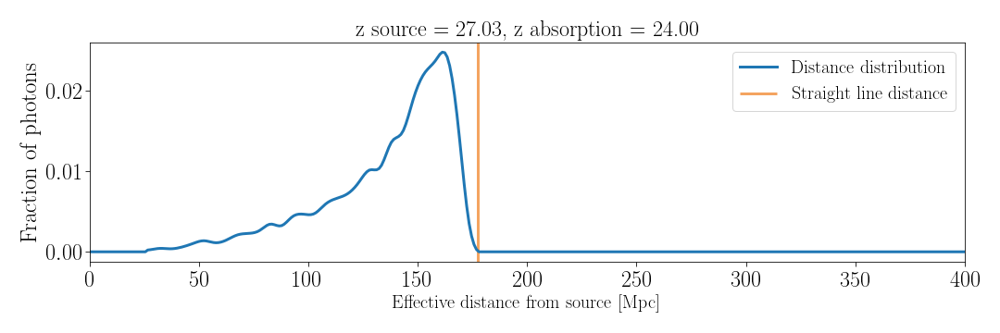
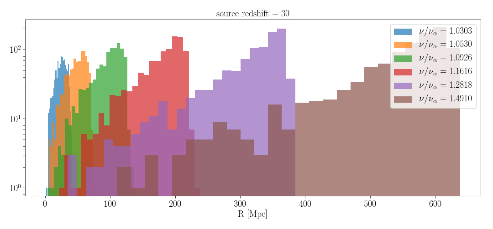

# Monte Carlo code for scattering of Lyman-alpha photons

The output is the distribution of distances at which photons are absorbed (with Lyman alpha frequency), given the frequency and redshift at which they were emitted.

